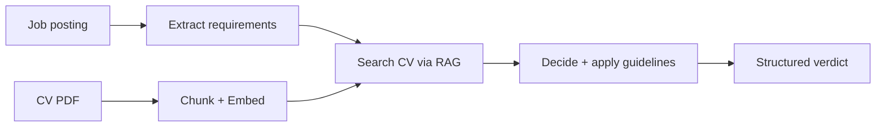

# Job Match Advisor

An AI agent that reads a job posting, compares it against your CV using RAG, and returns a structured **apply / apply-with-caution / do-not-apply** decision — with the exact criteria behind every verdict.

Built with Python, Streamlit, and the Claude API. It runs on *any* CV: the specialization comes from the CV and guidelines you provide, not from the code.


---

## Why

Scanning dozens of job postings by hand is slow, and it is easy to apply to roles that were never a fit (wrong location, on-site only, missing a hard requirement). This tool automates the first-pass judgment: it grounds every decision in your actual CV and in rules you define, so you spend time only on the roles worth pursuing.

## How it works



The decision runs as a **chain**: extract the job's requirements, retrieve the relevant CV sections through semantic search, then weigh them against your hard constraints and guidelines to produce a structured result.

## Features

- **RAG over your CV** — chunking, embeddings (Voyage AI), and semantic search, so decisions are grounded in real evidence.
- **Structured output** — every verdict returns a decision, confidence, matched/missing skills, and per-criterion reasoning (via tool use).
- **Hard constraints** — non-negotiable rules (remote-only, target regions) are enforced before skill matching.
- **Editable guidelines** — tune the decision rules from the UI; they persist between sessions.
- **Streaming summary** — a human-readable explanation streams live under the verdict.
- **Built-in evaluation** — a criteria-based test suite scores the agent's accuracy and renders an HTML report.

## Quick start

```bash
# 1. clone
git clone 
cd job-match-advisor

# 2. install (uv recommended)
uv sync
#   or: pip install -r requirements.txt

# 3. add your API keys
cp .env.example .env
#   then edit .env with your ANTHROPIC_API_KEY and VOYAGE_API_KEY

# 4. run
uv run streamlit run app.py
```

Then upload your CV (PDF) from the interface, paste a job posting, and get a verdict.

## Configuration

Set these in your `.env` file:

| Variable | Purpose |
|---|---|
| `ANTHROPIC_API_KEY` | Claude API access (analysis + decision) |
| `VOYAGE_API_KEY` | Embeddings for the CV RAG |
| `CLAUDE_MODEL` | Model to use (defaults to a sensible Claude model) |

## Project structure

```
job-match-advisor/
├── app.py            # Streamlit interface
├── config.py         # env + paths
├── rag/              # PDF loading, chunking, embeddings, search
├── tools/            # Claude client + the analysis chain
├── prompts/          # system prompt, guidelines, decision tool schema
├── eval/             # dataset, grader, evaluator, HTML report
└── data/             # CV index + stored guidelines (git-ignored)
```

## Evaluation

The agent ships with a criteria-based evaluation harness. Each test case describes a job and the criteria a correct decision must satisfy; a model grader scores the output from 1–10 and produces an HTML report (total cases, average score, pass rate).

```bash
uv run python run_report.py
```

## Notes

This started as a hands-on AI-engineering project, so the code favors clarity over cleverness. Your CV and job data stay local and are git-ignored by default — nothing personal is committed.

## License

MIT — see [LICENSE](LICENSE).